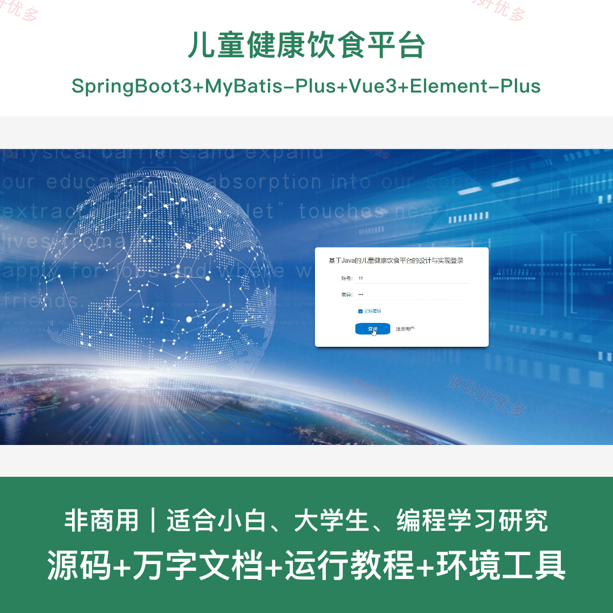
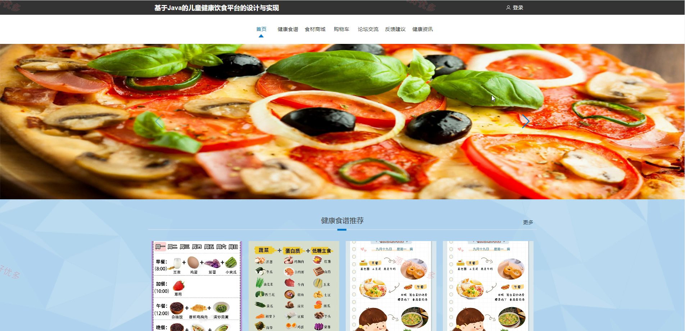
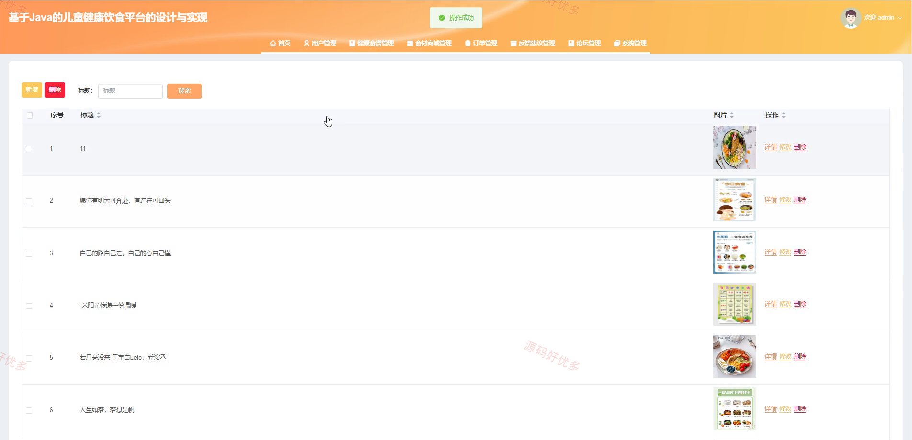
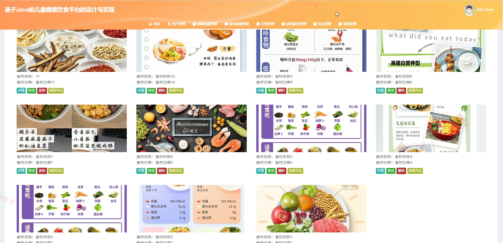
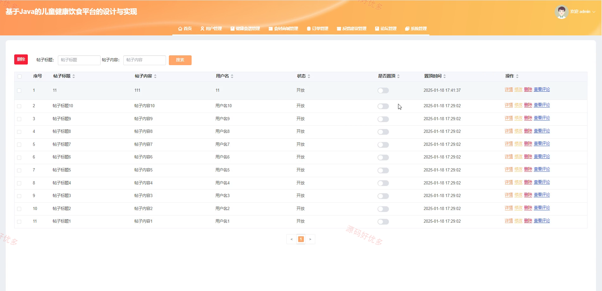
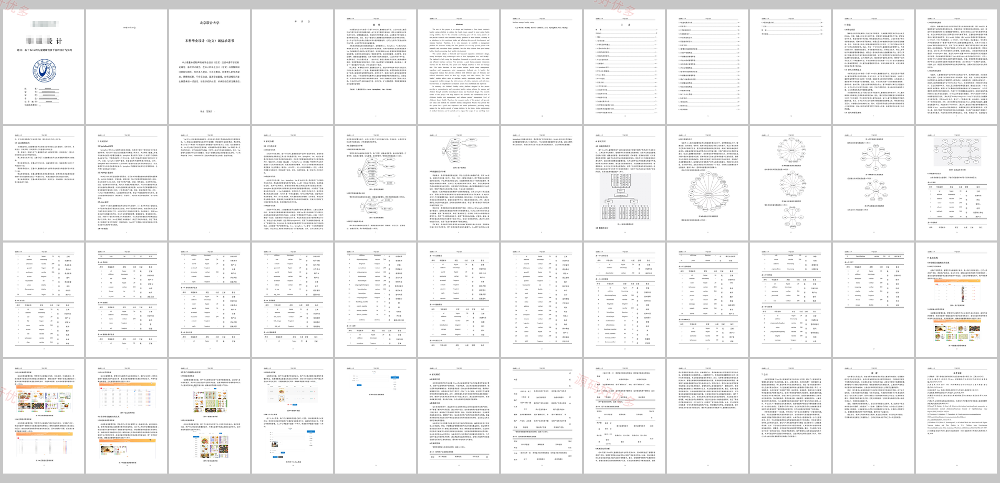

## 源码问题查看主页咨询

### 一、关键词
儿童健康饮食平台、健康食谱、食材商城、营养师咨询、订单管理

### 二、作品包含
源码+数据库+万字设计文档+全套环境和工具资源+本地部署教程

### 三、项目技术
前端技术： Html、Css、Js、Vue3.2、Element-Plus
后端技术：Java、SpringBoot3.3.0、MyBatis-Plus

### 四、运行环境（以下版本亲测，其他版本兼容性请自行测试）
开发工具：IDEA/eclipse + VSCODE

数据库：MySQL5.7+（共21张表）

数据库管理工具：Navicat10以上版本

环境配置软件： JDK1.8 + Maven3.6.3

前端Nodejs：16+

浏览器：谷歌浏览器

### 五、项目介绍
项目编号：springbootA556D

儿童健康饮食平台面向儿童膳食管理和健康饮食推荐场景，提供健康食谱、食材商城、营养师信息、论坛交流、订单管理和后台维护等功能，帮助完成饮食内容展示与线上购买流程演示。

角色：管理员、用户、营养师

用户功能：注册登录、健康食谱浏览、食材商城购买、论坛交流、收藏评论、营养师咨询、订单管理。

管理员功能：用户管理、营养师管理、健康食谱管理、食材分类和商城管理、论坛公告、订单管理、反馈管理、友情链接维护。

### 六、运行截图

